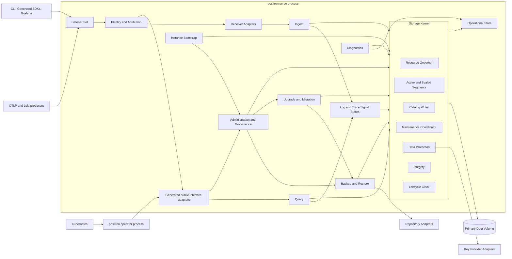
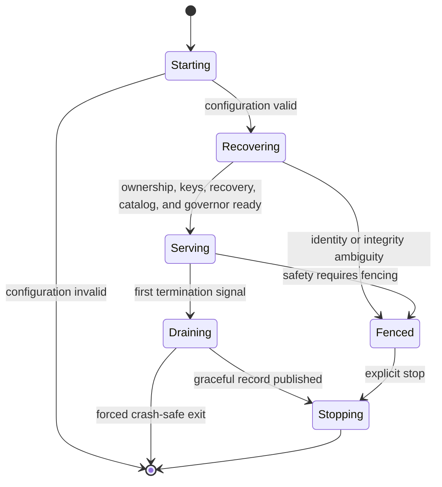
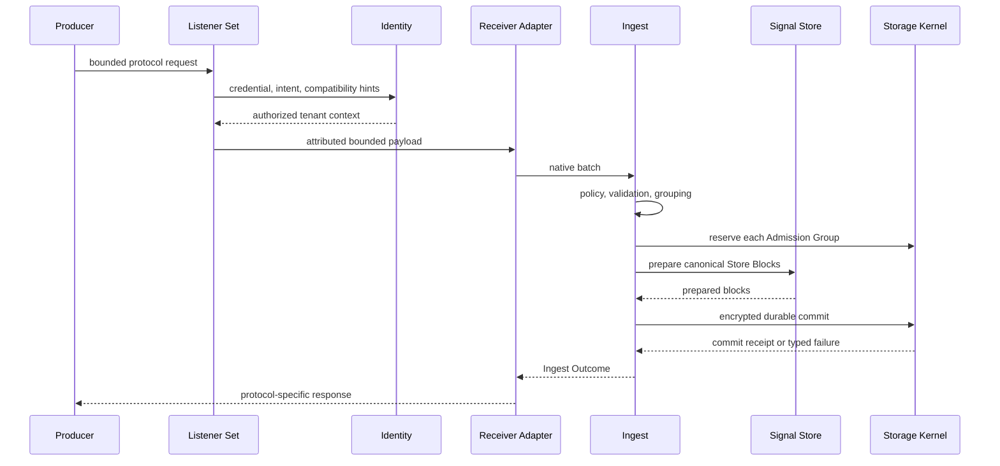
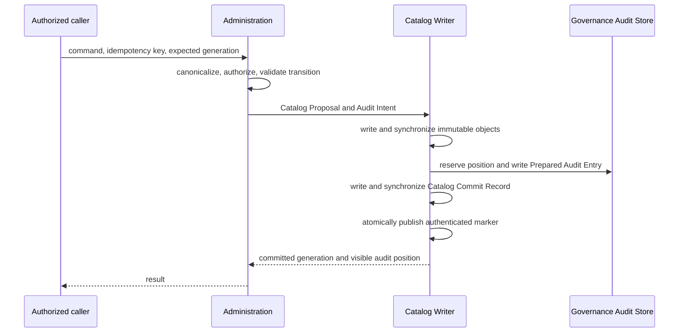
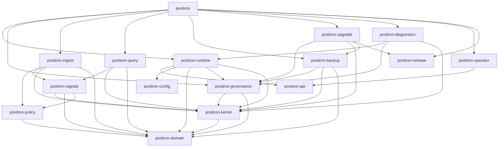

# Positron Whole-Application Design

> Status: proposed implementation design derived from the Release 1 product
> vision.
>
> Authority: [Project Positron](../project-positron.md), the binding
> [language](../CONTEXT.md), and accepted product [ADRs](adr/) remain
> normative. This document organizes those decisions into implementable
> modules and does not supersede them.

## 1. Purpose

This document defines the whole Positron application as a set of deep
modules: substantial behavior behind small interfaces, placed at seams where
behavior actually varies, and tested through those interfaces.

It answers five implementation questions that the fundamentals deliberately
leave open:

1. Which module owns each behavior and durable state?
2. What must a caller know at each interface?
3. Where are real seams, and which adapters occupy them?
4. In what direction may dependencies point?
5. Which interface-level tests prove the design without coupling tests to
   implementation details?

The design covers the complete Release 1 product: standalone Logs and Traces,
governance, lifecycle, storage, recovery, integrations, and distribution.
Metrics, Profiles, replication, and clustering influence
identities and interfaces but do not create speculative Release 1 runtime
machinery.

## 2. Design rules

### 2.1 Product constraints

The implementation must preserve these top-level facts:

- one Rust binary, with explicit `serve`, `operator`, and CLI command modes
- one multithreaded database process per Primary Data Volume
- one shared Storage Kernel
- separate Log and Trace Signal Stores
- immutable, append-only, encrypted persistent data
- no separate WAL or journal representation
- standalone local durability in Release 1
- bounded work and queues under one Resource Governor
- one Catalog Writer and one audited catalog publication point
- one Maintenance Coordinator for all database background work
- receiver compatibility only at Receiver Adapter seams
- one canonical API Definition for native public calls and Generated SDKs
- no database-domain behavior in the operator, Grafana integration, SDKs, or
  distribution tooling

### 2.2 Depth rules

This document uses the following design language:

- **Module**: anything with one interface and an implementation, at any scale.
- **Interface**: everything callers and tests must know, including invariants,
  ordering, failures, configuration, and performance expectations.
- **Seam**: the place where an interface lives and behavior can change without
  editing its caller.
- **Adapter**: one concrete implementation occupying a seam.
- **Depth**: the leverage callers receive from behavior hidden behind a small
  interface.
- **Leverage**: capability reused across callers and tests for the interface
  knowledge they must carry.
- **Locality**: the concentration of change, knowledge, defects, and
  verification inside the owning module.

The implementation applies the following rules:

- A module earns its existence when deleting it would spread its complexity
  across multiple callers.
- A module's interface includes types, invariants, ordering, failure modes,
  configuration, and performance expectations—not only Rust methods.
- A concrete module remains a concrete type. A trait or port is introduced
  only at a real seam with at least two justified adapters.
- Callers and tests use the same interface.
- Dependencies are accepted during composition. Deep modules do not locate
  global dependencies or construct provider clients internally.
- Results cross interfaces as typed outcomes. Hidden side effects, stringly
  errors, and best-effort completion are rejected.
- Internal seams may exist for deterministic tests and fault injection, but
  they remain private to the owning module.

### 2.3 Core invariants

Every module interface must make it impossible, or at minimum explicit and
testable, to violate these product invariants:

- no loss of acknowledged Store Blocks
- no unauthenticated or corrupt telemetry returned as valid
- authenticated encryption for every managed persistent object
- no prohibited secret or plaintext key disclosure
- authoritative Tenant Attribution and physical tenant isolation
- no system-administrator data-plane impersonation
- atomic governance-sensitive state and audit publication
- no unbounded queue, task, cursor, lease, or maintenance backlog
- verified backup recovery and restore only into fresh storage
- cryptographically complete Tenant Purge within managed scope
- signed artifact and Release Manifest authenticity

## 3. Whole-system shape



The arrows represent allowed caller-to-dependency direction, not ownership of
durable state. The operator uses the same generated public client as other
administrative callers; it never links database storage or Signal Store
implementation into its reconciliation path.

### 3.1 Process modes

The single executable has mutually exclusive top-level modes:

- `positron serve` composes and runs the database.
- `positron operator` composes and runs the Kubernetes reconciler.
- online CLI commands call the public or Control Listener interfaces.
- offline CLI commands acquire exclusive storage ownership and compose only
  the read-only or explicitly mutating workflow they require.
- `positron release verify` composes offline release-trust verification and
  does not open database state.

The operator and database may run as separate processes from the same artifact.
They are never hidden inside one process or required to coexist.

### 3.2 Dependency direction

Dependencies point inward toward behavior owners:

1. Network, CLI, operator, Grafana, and SDK adapters depend on public
   interfaces.
2. Ingest and Query depend on Identity results, Signal Stores, and narrow
   Storage Kernel capabilities.
3. Signal Stores depend on Storage Kernel block and snapshot capabilities;
   the Storage Kernel never depends on OTLP, Loki, query syntax, or
   signal-specific physical layouts.
4. Administration depends on the Catalog, Resource Governor, Maintenance
   Coordinator, and registered Durable Operation handlers.
5. Backup and Restore depend on Storage Kernel snapshots and the Repository
   port; the Storage Kernel does not depend on a cloud provider SDK.
6. Runtime composition may depend on every module. No deep module depends on
   the composition root.

Cycles are a design failure. Shared wire messages, configuration structs, or
filesystem paths may not be used to disguise one.

## 4. Module map

The initial module map is intentionally coarser than the domain glossary.
Not every noun deserves a crate or public interface.

| Module | Interface callers learn | Behavior hidden by the implementation |
| --- | --- | --- |
| Domain Types | Validated shared identities and value types | Construction checks, type preservation, namespace separation, and impossible states |
| Configuration | Resolve, validate, plan, and publish one Effective Configuration | Source precedence, schema generation, secrecy, mutability, migration, and semantic diff |
| Application Runtime | Run the database and return one truthful exit outcome | Process Phase transitions, recovery ordering, listener activation, Drain, and dependency retry |
| Instance Bootstrap | Initialize, resume, or claim one provably classified instance | Empty-root proof, initialization transaction, instance and key identity, default tenant, and one-time credential custody |
| Listener Set | Activate, replace, and drain a complete listener generation | TLS, mTLS, proxy trust, Connection Admission, protocol limits, and socket lifetime |
| Public Interface | Generated native request and result semantics | gRPC and HTTP/JSON mapping, OpenAPI generation, capability negotiation, and stable error mapping |
| Identity and Attribution | Turn a credential and intended action into an authorized context | Hash verification, scope, tenant binding, lifecycle checks, proxy evidence, and non-enumeration |
| Receiver Adapters | Decode one bounded attributed protocol request and render its outcome | OTLP and Loki protocol mapping, partial-result rules, and compatibility-specific validation |
| Ingest | Accept one attributed native batch and return one typed Ingest Outcome | Policy ordering, validation, grouping, reservations, routing, Store Block preparation, commit, and acknowledgment |
| Signal Stores | Prepare, scan, and physically optimize one signal's data | Log and Trace layouts, indexes, summaries, consolidation, pruning, and compaction logic |
| Query | Start, resume, tail, or export one authorized query | Parsing, typed planning, budgets, snapshots, leases, execution, cursors, batches, and digests |
| Storage Kernel | Commit blocks, pin snapshots, publish catalog state, schedule work, and inspect safely | Filesystem durability, segment lifecycle, catalog atomicity, resources, time, encryption, integrity, and reclamation |
| Administration and Governance | Execute or inspect one authorized administrative intent | Idempotency, generations, tenant and principal transitions, audit binding, and Durable Operation state |
| Backup and Restore | Start or inspect a backup, restore, or repository workflow | Snapshot capture, incremental transfer, registry CAS, signatures, recovery proof, and fresh-target publication |
| Upgrade and Migration | Plan, run, or inspect one supported version transition | Signed preflight, Drain, Quiescent Upgrade Snapshot, copy-on-write migration, atomic publication, and recovery |
| Operational State | Record typed facts and derive bounded health and telemetry views | Cardinality control, redaction, stable metrics and logs, liveness, readiness, and self-export protection |
| Diagnostics | Produce one Doctor Report or Support Bundle | Read-only inspection, allowlists, pseudonymization, declared truncation, encryption, and signing |
| Positron Operator | Reconcile Kubernetes desired state through public Positron calls | Watches, lease leadership, server-side apply, drift, finalizers, status, and operation reattachment |
| Release Trust | Verify one artifact set against an installed Project Trust Root | Release Manifest authentication, revocation, checksums, compatibility identity, and reproducibility |

The deletion test confirms the central depth:

- deleting Ingest spreads policy order, grouping, reservations, and
  acknowledgment rules across every Receiver Adapter
- deleting Query spreads planning, budgets, snapshots, cursors, and terminal
  truth across transports, CLI, Grafana, and SDKs
- deleting the Storage Kernel spreads durability, encryption, reachability,
  resources, lifecycle, and integrity into every Signal Store
- deleting Administration spreads idempotency, generations, state machines,
  audit binding, and operation recovery across every administrative caller
- deleting Backup and Restore spreads repository correctness, recovery proof,
  and purge reachability across provider adapters and the operator

Receiver, provider, and distribution adapters may remain small because their
role is to occupy a seam. They must not become alternate owners of the hidden
behavior listed above.

### 4.1 Domain Types

This module contains only invariant-bearing values shared by at least two deep
modules:

- Tenant ID, Tenant Slug, Principal ID, Scope, and attribution types
- Signal kind, Virtual Shard ID, Commit Position, and object identities
- typed telemetry values, Attribute Occurrence Sets, and namespace identity
- Event Time, Ingest Time, Query Time, and provenance
- operation, generation, cursor, snapshot, and catalog identities

It contains no I/O, wire decoding, storage encoding, configuration loading,
provider client, or convenience utility collection. A type used by only one
module stays with its owner. Deleting this module would otherwise duplicate
identity and typing invariants across Ingest, Query, Governance, Signal Stores,
and the Storage Kernel.

### 4.2 Configuration

The Configuration module owns the complete Configuration Contract and exposes
three operations:

1. resolve all configured sources into a redacted, typed candidate
2. compare a candidate with the current Effective Configuration and return a
   typed application plan
3. publish an already validated plan according to Configuration Mutability

The interface returns module-specific typed sections so a caller receives only
its settings. No other module reads environment variables, command arguments,
TOML, Kubernetes Secrets, or provider credentials directly.

Live reload validates the whole candidate before any publication. The module
reports whether a plan is live-reloadable, requires Drain, requires restart, or
attempts to change immutable initialized state. Governance-sensitive
publication is completed through Administration and the Catalog Writer rather
than by mutating a global configuration object.

### 4.3 Application Runtime

The Application Runtime interface is conceptually:

```rust
async fn serve(
    modules: ServerModules,
    host: HostInputs,
) -> ExitOutcome;
```

Its implementation owns the `Starting`, `Recovering`, `Serving`, `Draining`,
`Fenced`, and `Stopping` Process Phases. The binary composition root constructs
the module assembly once and passes it to Runtime. Modules never fetch
dependencies from a dependency locator, global singleton, or ambient process
state.

The runtime makes readiness a derived fact:



Only the Control Listener and minimal Operations Listener exist during startup
and recovery. Data listeners activate only after recovery establishes every
required invariant. A recoverable external-provider outage remains alive and
not-ready with bounded retry; ambiguity fences.

#### Instance Bootstrap

Instance Bootstrap is a concrete internal Runtime module with three operations:

```rust
fn classify(data: DataRoot, secrets: SecretsRoot) -> BootstrapState;
async fn initialize(roots: ProvablyEmptyRoots, plan: InitializationPlan)
    -> InitializedInstance;
fn claim(claim: UnclaimedBootstrapClaim) -> ClaimedCredential;
```

It distinguishes empty, provably incomplete, initialized, and inconsistent
root pairs. Only provably empty roots may initialize, and only a transaction
owned by this module may resume provably incomplete initialization.

Initialization coordinates instance identity, mandatory Data Protection,
Instance Integrity Key, default Tenant, initial policies and quotas, one
system-administrator API key, initial Catalog Generation, and governance
evidence. Interactive initialization may return the credential once.
Non-interactive initialization publishes owner-only claim material outside the
Primary Data Volume; the Control Listener returns it once and atomically
destroys its recoverable form.

Missing or mismatched keys, one initialized root paired with an unrelated
root, or ambiguous catalog state never select initialization or replacement-key
generation.

### 4.4 Listener Set

The Listener Set is an internal Runtime module with one generation-oriented
interface:

```rust
fn activate(candidate: ValidatedListenerSet) -> ListenerGeneration;
async fn replace(
    current: ListenerGeneration,
    candidate: ValidatedListenerSet,
) -> ReplaceOutcome;
async fn drain(current: ListenerGeneration, deadline: Deadline) -> DrainOutcome;
```

It owns the Control, Operations, `api`, `otlp-grpc`, `otlp-http`, and
`loki-push` roles. A listener generation contains its complete Network Listener
Profiles; partial listener mutation is impossible.

Connection Admission occurs before authentication and bounds global and
per-address sockets, handshakes, headers, bodies, decompression, streams,
windows, messages, keepalive, timers, and file descriptors. Successful
authentication then enables Principal and Tenant accounting. The operating
system backlog is never treated as admission. The listener may read and
decompress only within that reservation; it performs no structural telemetry
decoding.

Replacement binds and validates the complete new generation before the old
generation stops admission. Existing connections drain under the policy that
admitted them.

### 4.5 Public Interface

The Public Interface module is generated from `api/positron/v1`. Its interface
is larger than the Protobuf declarations: callers must also know authorization,
idempotency, generation, budget, completion, compatibility, and retry
semantics.

The module owns:

- generated Rust server and client types
- gRPC and HTTP/JSON adapters
- OpenAPI generation
- stable public error and terminal-result mapping
- Capability Statement negotiation
- Schema Digest calculation and embedding

Wire types stop at this seam. Adapters convert them into owner-defined domain
commands and results. Public messages are never Store Block, Catalog Object,
or configuration persistence formats.

CLI commands, the Positron Operator, Generated SDKs, and the Positron Data
Source use generated clients. They do not import private Rust domain modules to
bypass the public interface.

The Release 1 SDK Release Set contains Rust, TypeScript, Python, Go, Java/JVM,
and .NET adapters with the same API version and Schema Digest. Upstream OTLP
definitions remain separately pinned receiver contracts and are never copied
into the Positron API Definition.

### 4.6 Identity and Attribution

The hot-path Identity interface performs one operation:

```rust
fn attribute(
    credential: PresentedCredential,
    intent: RequestedIntent,
    hints: CompatibilityHints,
) -> Result<AuthorizedContext, AttributionFailure>;
```

An `AuthorizedContext` binds exactly one Principal and Scope and, for
data-plane work, exactly one Tenant ID. It is an unforgeable typed input to
Ingest, Query, and tenant administration.

The implementation hides salted-hash verification, revocation, immutable
identity snapshots, tenant lifecycle checks, External Tenant Alias validation,
trusted-proxy handling, and constant-shape failures. A system-administrator
context cannot be converted into a tenant data context.

Authentication reads an immutable identity view pinned from the current
Catalog Generation. Administration owns identity mutation; the Identity module
never edits principals or tenants.

### 4.7 Receiver Adapters

The Receiver Adapter seam is real because Release 1 has multiple adapters:

- OTLP gRPC Logs
- OTLP gRPC Traces
- OTLP HTTP Protobuf and JSON Logs
- OTLP HTTP Protobuf and JSON Traces
- Loki Push
- Loki's OTLP log path

Its semantic shape is:

```rust
trait ReceiverAdapter {
    fn decode(
        &self,
        request: AttributedBoundedPayload,
    ) -> Result<NativeBatch, ReceiveFailure>;

    fn render(&self, outcome: IngestOutcome) -> ProtocolReply;
}
```

`AttributedBoundedPayload` proves that Connection Admission bounds and Tenant
Attribution already succeeded. Structural protocol decoding happens here.
Vendor fields may become native values or validated compatibility hints but
cannot select a tenant or weaken native invariants.

OTLP and Loki response behavior remains adapter-specific. In particular, Loki
Push returns an error when only part of a request commits because its protocol
cannot express Positron's Partial Ingest Result; it never rolls successful
groups back.

### 4.8 Ingest

Ingest is a concrete deep module with one public operation:

```rust
async fn accept(batch: AttributedNativeBatch) -> IngestOutcome;
```

It is not a trait because Release 1 has one ingest implementation. Constructor
injection supplies Signal Stores, an ingest-capability Storage Kernel handle,
policy snapshots, shard routing, and operational observation.

The module owns the exact pipeline:

1. snapshot one Ingest Policy generation
2. evaluate bounded prospective policy
3. validate native signal semantics and post-policy Value Limit Profile
4. split records into Admission Groups by Tenant, Signal Store, and Virtual
   Shard
5. reserve memory, queue slots, and disk headroom
6. ask the owning Signal Store to prepare canonical Store Blocks
7. commit each group through the Storage Kernel
8. return committed, retryable, and permanently rejected outcomes

Hard transport, decompression, and structural limits remain earlier than
policy. Policy is the only mechanism allowed to remove, redact, or truncate
otherwise valid native values before persistence.

An Ingest Outcome records each group's unambiguous state. A timeout may leave
the producer uncertain and retry may duplicate committed observations.
Neither the interface nor an adapter claims request-wide atomicity,
exactly-once delivery, or global deduplication.

### 4.9 Signal Stores

The Signal Store seam is real because Log Store and Trace Store are distinct
adapters with distinct physical designs. The interface is deliberately about
behavior, not one universal record layout:

```rust
trait SignalStore {
    fn kind(&self) -> SignalKind;

    fn prepare(
        &self,
        records: NativeSignalRecords,
        context: StoreWriteContext,
    ) -> Result<PreparedStoreBlocks, StoreFailure>;

    fn scan(
        &self,
        fragment: SignalPlanFragment,
        snapshot: StoreSnapshot,
    ) -> Result<SignalExecution, StoreFailure>;

    fn plan_maintenance(
        &self,
        request: SignalMaintenanceRequest,
    ) -> Result<SignalMaintenancePlan, StoreFailure>;
}
```

The final Rust representation may use enums or associated types, but it must
preserve this knowledge split:

- the Storage Kernel owns segment envelopes, durability, encryption,
  reachability, lifecycle, and resources
- each Signal Store owns canonical block bytes, indexes, statistics,
  encodings, pruning, and signal-specific consolidation
- Query owns language and cross-signal plan semantics
- Ingest owns receiver-independent admission ordering

The Log Store hides full-text structures, scalar attribute indexes, generic
typed overflow, and workload-driven Attribute Promotion.

The canonical Log Store Block layout and bounded logical scan are defined by
[`log-store-block-format-v2.md`](log-store-block-format-v2.md), which preserves
the complete version 1 reader contract in
[`log-store-block-format-v1.md`](log-store-block-format-v1.md).

The Trace Store hides immutable Span Observations, logical-span consolidation,
conflicts, trace-summary deltas, quiescence, structural indexes, and incomplete
analysis.

No Release 1 Metric Store or Profile Store adapter exists. Adding one later
requires a complete native implementation and conformance target, not an empty
registry entry.

### 4.10 Query

The Query module exposes four explicit operations because their completion
contracts differ:

```rust
async fn start(request: AuthorizedQuery) -> QuerySession;
async fn resume(request: AuthorizedResume) -> QuerySession;
async fn tail(request: AuthorizedTail) -> TailSession;
async fn export(request: AuthorizedExport) -> OperationId;
```

It owns both native pipeline and bounded SQL parsing, typed Logical Plans,
costing, Query Budget admission, Query Snapshots, Snapshot Leases, execution,
cross-signal Correlation, Result Batches, Query Cursors, terminal status, and
Result Digests.

Signal Stores receive typed plan fragments, never query strings. The Storage
Kernel returns snapshot-scoped verified block readers, never filesystem paths
or key material.

A Query Snapshot pins each involved Signal Store's committed high-water mark.
It does not claim one transactionally atomic cross-signal instant. Cursor
resume reauthenticates, rechecks lifecycle and scope, retains the same snapshot,
and accumulates the original budget. An ambiguous reconnect may repeat only
the same batch sequence and digest.

`Complete` is a terminal fact, never an inferred absence of error. Every stream
emits exactly one terminal status.

### 4.11 Storage Kernel

The Storage Kernel is the shared database foundation and the deepest runtime
module. Its one external interface is a set of capability handles created
together but handed to callers narrowly:

```rust
struct KernelHandles {
    ingest: KernelIngest,
    query: KernelQuery,
    control: KernelControl,
    inspect: KernelInspect,
}
```

- `KernelIngest` commits prepared blocks and returns authenticated commit
  receipts.
- `KernelQuery` pins Query Snapshots and yields verified snapshot readers.
- `KernelControl` publishes Catalog Transactions and submits Maintenance
  Tasks.
- `KernelInspect` exposes bounded read-only status and verification views.

No caller receives raw volume mutation, key, catalog-marker, or active-segment
file access.

The implementation contains the following deep internal modules.

#### Primary Data Volume

This is a concrete filesystem module, not a generic storage port. It owns the
Storage Capability Probe, Storage Ownership Lock, synchronized file and
directory operations, same-filesystem atomic publication, safe truncation, and
storage-pressure observations.

Tests use real temporary filesystems and deterministic file-operation fault
injection. Object stores, raw block devices, and multi-writer storage do not
implement this interface in Release 1.

#### Active Segment Ledger

The ledger appends canonical Store Blocks directly to single-tenant,
single-signal active segments, publishes Durability Frontiers, assigns Commit
Positions, exposes committed active data to queries, and seals without
re-encoding.

Standalone acknowledgment follows durable synchronization. Recovery may
truncate only an incomplete frame strictly after the authenticated frontier.
An interrupted encrypted active segment is sealed and a new segment and DEK
are used.

The normative byte layout, frontier publication order, recovery rules, and
bounds are defined in
[`active-segment-format-v1.md`](active-segment-format-v1.md).

#### Catalog

The Catalog internal interface has three operations:

```rust
fn pin() -> CatalogSnapshot;
async fn commit(
    expected: CatalogGeneration,
    proposal: CatalogProposal,
    audit: Option<AuditIntent>,
) -> Result<CatalogCommit, CatalogFailure>;
fn rewrap(
    transaction: TransactionId,
    replacement: CatalogWrappingKey,
    intent: AuditIntent,
) -> Result<CatalogRotation, CatalogFailure>;
```

The Catalog Writer is the only publication authority. It writes immutable
encrypted objects, reserves and prepares governance evidence, writes and
synchronizes the Catalog Commit Record, and atomically publishes one
authenticated marker. Readers pin immutable generations.

Telemetry Store Block append does not perform a Catalog Transaction. Catalog
publication covers segment and control-plane lifecycle transitions.

The canonical Catalog durable layouts, bounds, compatibility set, and crash
rules are defined only in [Catalog durable format v1](catalog-format-v1.md).
This application design owns the flow: a commit jointly publishes one complete
state generation and its optional Governance Audit Record through the sole
Catalog Writer.

Root rotation is one governed durability-completion operation. The supplied
Administration transaction deterministically publishes audited `started`,
`verified`, and `completed` Catalog transactions. Rewrap changes only verified
artifact envelope headers and leaves marker authentication and content-derived
identities stable. The successor route remains overlapped with its predecessor
through verification; only the durable completed generation authorizes
predecessor retirement. Restart supplies both routes for a partial pass and
retries the same operation idempotently.

#### Resource Governor

The Resource Governor's primary operation is:

```rust
fn reserve(claim: WorkClaim) -> Result<ResourceReservation, AdmissionFailure>;
```

The reservation is a capability that follows work across module calls and
releases capacity on every terminal path. It covers bounded memory, queue
slots, I/O, CPU work, file descriptors, and disk amplification as applicable.

The implementation owns hierarchical ceilings, tenant quotas, weighted
fairness, priority classes, Disk Pressure State, and the protected Recovery
Reserve. No module creates an unaccounted queue or private capacity pool.

#### Maintenance Coordinator

The coordinator accepts typed, stable Maintenance Tasks and owns their
conflict graph, priority, fairness, checkpoint, retry, cancellation, and
terminal outcome. The Storage Kernel owns an internal Maintenance Task handler
port. Signal Stores, Backup and Restore, Data Protection, and other task owners
provide typed adapters at composition, so the coordinator can resume work by
stable task kind without depending on their implementations. Only the
coordinator admits and schedules those handlers.

All output is copy-on-write and becomes current only through a Catalog
Transaction. Periodic work uses the Lifecycle Clock; urgent work is
event-driven. Expiring pauses affect only declared optional task classes.

Network accept loops, request execution, and runtime critical workers are not
Maintenance Tasks. Database lifecycle and optimization work listed in ADR-0071
is.

#### Lifecycle Clock

This module assigns Ingest Time and maintains the persisted non-decreasing
Lifecycle Clock. It exposes provenance-bearing time decisions rather than a
raw wall-clock value. Monotonic deadlines and leases remain separate from
producer time.

`ClockUncertain` pauses destructive age-derived work but cannot rewrite Event
Time or silently advance retention.

#### Data Protection

Data Protection owns the encryption hierarchy, frame protection, Key
Envelopes, Envelope Catalog, Key Cache Leases, Instance Integrity Key, local
key custody, and key lifecycle workflows.

Its interface accepts typed object identities and plaintext or ciphertext
frames; it never returns a Root KEK or Tenant KEK to a caller. The Storage
Kernel creates authoritative frame context so Signal Stores cannot omit
tenant, shard, signal, object kind, sequence, or Format Epoch binding.

The Key Provider port and Crypto Backend are internal seams. Provider
credentials remain inside adapters. Release builds cannot select test
cryptography.

The Key Provider interface is intentionally narrower than any provider SDK:

```rust
trait KeyProvider {
    fn identity(&self) -> ProviderKeyUri;

    async fn probe(
        &self,
        context: EnvelopeContext,
    ) -> Result<ProviderCapabilities, KeyProviderFailure>;

    async fn wrap(
        &self,
        payload: Secret<WrappedKeyPayload>,
        context: EnvelopeContext,
    ) -> Result<KeyEnvelope, KeyProviderFailure>;

    async fn unwrap(
        &self,
        envelope: KeyEnvelope,
        context: EnvelopeContext,
    ) -> Result<Secret<WrappedKeyPayload>, KeyProviderFailure>;
}
```

It has no create, enable, disable, delete, or alias-retarget operation for an
external Root KEK. The adapters are the protected local key file, AWS KMS,
Google Cloud KMS, Azure Key Vault and Managed HSM, Vault Transit, OpenBao
Transit, and KMIP 2.1. Rotation and migration are Data Protection workflows
over immutable Key Epochs and multiple envelopes, not extra provider methods.

Local Recovery Bundle creation and verification are explicit Data Protection
workflows. A bundle is never a Backup Snapshot or Key Provider adapter, and
backup readiness remains false until the applicable local or external recovery
path verifies.

#### Integrity

Integrity authenticates every frame before a Signal Store sees plaintext,
validates startup reachability and Durability Frontiers, runs bounded scrubs,
and produces Verification Reports. Isolated damage creates a Quarantined
Segment; ambiguous catalog, identity, key, ownership, or acknowledged-frontier
damage fences the instance.

There is no repair-by-guessing interface. Restore into fresh storage and
explicit Segment Abandonment are separate audited workflows.

### 4.12 Administration and Governance

Administration exposes:

```rust
async fn execute(
    context: AuthorizedAdminContext,
    command: AdminCommand,
) -> AdminOutcome;

async fn inspect(
    context: AuthorizedAdminContext,
    query: AdminQuery,
) -> AdminReadResult;
```

It owns canonical request digests, Administrative Idempotency Keys, expected
Resource Generations, tenant and principal state machines, policy and quota
activation, redacted Governance Audit intent, and Durable Operation records.

Immediate mutations produce a complete Catalog Proposal and Audit Intent and
become visible only through one Catalog commit. Long work first commits a
stable Operation ID, then delegates typed phases to registered operation
handlers through the Maintenance Coordinator.

The internal Durable Operation handler seam has multiple adapters: backup,
restore, Tenant Purge, key lifecycle, verification, format migration, and
upgrade. Each adapter declares preflight, progress, cancellation, and its
Irreversible Boundary. A transport timeout leaves the outcome unknown; callers
resolve the original idempotency key or Operation ID.

The Governance Audit Store's durable encoding and sequencer live in the
Storage Kernel. Administration owns the meaning and authorization of the audit
event. Neither can publish a governance-sensitive mutation alone.

### 4.13 Backup and Restore

Backup and Restore is a deep operation-handler module. It exposes creation and
inspection of repository, backup, verification, and fresh-target restore
workflows; ordinary callers never invoke provider methods directly.

The Repository port reflects only the behavior Positron requires:

```rust
trait Repository {
    async fn identify(&self) -> Result<RepositoryIdentity, RepositoryFailure>;
    async fn head(
        &self,
        object: ObjectId,
    ) -> Result<ObjectMetadata, RepositoryFailure>;
    async fn read_range(
        &self,
        range: ObjectRange,
    ) -> Result<ChecksummedBytes, RepositoryFailure>;
    async fn put_if_absent(
        &self,
        object: ImmutableObject,
    ) -> Result<PutOutcome, RepositoryFailure>;
    async fn resume_upload(
        &self,
        upload: UploadState,
    ) -> Result<PutOutcome, RepositoryFailure>;
    async fn compare_and_swap_head(
        &self,
        change: RegistryHeadChange,
    ) -> Result<CasOutcome, RepositoryFailure>;
    async fn delete(
        &self,
        object: ObjectId,
    ) -> Result<DeleteOutcome, RepositoryFailure>;
}
```

Listing is intentionally absent as a correctness primitive. Provider adapters
normalize identity, metadata, checksums, retryability, throttling, conditional
publication, multipart recovery, and observable deletion.

Release 1 adapters are local filesystem, AWS S3, each named S3-compatible
target, Google Cloud Storage, and Azure Blob Storage. Mocks support module
tests; only real-provider integration tests support a compatibility claim.

Backup capture rolls active segments, pins one Catalog Generation, transfers
immutable encrypted objects, publishes signed repository control state, and
reports success only after complete verification and independent key-recovery
readiness.

Restore opens only an empty offline target, verifies the current registry chain
and snapshot, applies Purge Tombstones, and atomically publishes the recovered
instance. It has no merge or in-place overwrite path.

### 4.14 Upgrade and Migration

Upgrade and Migration is a concrete Durable Operation handler. Its interface
accepts an authorized target release and returns a preflight plan or stable
Operation ID. The implementation hides artifact verification, Compatibility
Manifest and Migration Graph checks, dependency readiness, disk amplification,
Drain, snapshot, format transformation, publication, and recovery.

A format-neutral upgrade may replace the executable and restore the previous
image if startup fails. A format-changing upgrade must:

1. stop admission and complete Drain
2. seal active segments
3. create and verify a Quiescent Upgrade Snapshot
4. transform into copy-on-write staging under a Resource Reservation
5. authenticate the complete candidate
6. atomically publish one supported Format Epoch

Failure before publication leaves the previous version and format current.
Failure after publication never starts an incompatible older binary; recovery
restores the Quiescent Upgrade Snapshot into fresh storage. The Positron
Operator requests and observes this module through the Public Interface rather
than reimplementing any phase.

### 4.15 Operational State

Operational State receives typed facts from owning modules and derives bounded
metrics, structured operational logs, Health State, readiness, liveness, and
optional external OTLP traces. Owning modules do not construct Prometheus
labels or write free-form diagnostic payloads.

The interface accepts closed event and status types. The implementation
controls redaction, stable names, bounded labels, aggregation, and the
self-export guard. Tenant-specific detail remains in authenticated
administrative reads rather than metric labels.

### 4.16 Diagnostics

Diagnostics consumes existing read-only inspection outputs:

- `doctor` returns a bounded Doctor Report and never mutates
- offline doctor acquires exclusive read-only storage ownership
- support bundle creation uses a typed closed allowlist
- unknown fields are excluded rather than heuristically scrubbed
- identifiers are pseudonymized unless explicitly retained
- every omission and truncation appears in the Redaction Report

Repair does not share the doctor interface. It remains an idempotent audited
administrative workflow with preview and confirmation.

### 4.17 Positron Operator

The Positron Operator module's external interface is `run` for a configured
Kubernetes scope. Internally, reconciliation separates observation, pure plan
construction, and effect application so plans can be tested without a live
cluster.

It owns Kubernetes resources, watches, Lease leadership, server-side apply
ownership, finalizers, Events, and status. It calls the database through a
Generated SDK adapter and derives deterministic Administrative Idempotency
Keys from resource UID, generation, and operation type.

It never:

- opens a Primary Data Volume
- mounts a live PVC into another Positron process
- compacts, verifies, encrypts, backs up, or restores data itself
- infers database completion from a Kubernetes Job or volume snapshot
- represents more than one Release 1 database instance as HA

### 4.18 Release Trust

Release Trust provides one offline verification interface:

```rust
fn verify_release(
    artifacts: ArtifactSet,
    trust: InstalledProjectTrustRoot,
) -> ReleaseVerificationReport;
```

It owns Release Manifest authentication, revocation, checksums, Schema Digest,
Compatibility Manifest identity, target matching, transparency evidence, and
Reproducible Payload comparison. It does not reuse the Instance Integrity Key
as the Project Trust Root.

## 5. Real seams and adapters

| Seam | Dependency category | Adapters | Visibility | Reason it is real |
| --- | --- | --- | --- | --- |
| Public Interface transport | Remote but owned | gRPC, HTTP/JSON, in-memory/live conformance client | External | Multiple transports and clients exercise one native interface |
| Receiver Adapter | In-process | OTLP gRPC, OTLP HTTP Protobuf/JSON, Loki Push, Loki OTLP path | External ingress | Protocol semantics genuinely vary |
| Signal Store | In-process | Log Store, Trace Store | Internal | Physical encoding and query behavior genuinely vary by signal |
| Key Provider | True external | local file, AWS, GCP, Azure, Vault, OpenBao, KMIP | Internal to Data Protection | Provider identity, credentials, outage, and wrapping behavior vary |
| Repository | True external | local, S3, named S3-compatible, GCS, Azure Blob | Internal to Backup | Conditional publication, upload, checksum, and deletion behavior vary |
| Durable Operation handler | In-process | backup, restore, purge, key work, verify, migration, upgrade | Internal to Administration | Phase and irreversible semantics vary by operation |
| Maintenance Task handler | In-process | segment, compaction, retention, scrub, schema, key, repository, backup, export, migration, and expiry work | Internal to Storage Kernel | Durable task phases vary while admission and scheduling remain centralized |
| Catalog publication | Local-substitutable | filesystem publication, test-only fault adapter | Internal to Storage Kernel | Crash points must be deterministic; future consensus uses the same logical commit seam |
| Crypto Backend | In-process | Release 1 Rust backend, test-only known-answer/fault adapter | Internal to Data Protection | ADR-0044 requires one replaceable cryptographic seam and cross-platform proof |
| Clock and entropy | In-process | host sources, deterministic test adapters | Internal to owners | Safety logic requires reproducible time jumps, restart anchors, and nonce tests |
| Kubernetes effects | True external | Kubernetes client, deterministic fake, live conformance cluster | Internal to Operator | Reconciliation plans must survive outages and retries |

The following are intentionally not ports:

- Primary Data Volume: Release 1 has one concrete supported filesystem
  contract. A `StorageBackend` abstraction would falsely imply object-store or
  multi-writer equivalence.
- Ingest: there is one native ingest implementation.
- Query: there is one native execution implementation.
- Catalog Writer: there is one Release 1 publication authority.
- Resource Governor: no module may substitute a private limiter.
- Maintenance Coordinator: no Signal Store may substitute a private scheduler.

## 6. Canonical flows

### 6.1 Startup and recovery

1. Runtime resolves and validates the complete Configuration Contract.
2. It binds only Control and Operations listeners.
3. Instance Bootstrap classifies the data and secrets roots without treating
   inconsistent state as empty.
4. The Primary Data Volume runs its capability probe and acquires ownership.
5. Provably empty or incomplete roots follow the transactional initialization
   path; an initialized instance continues with recovery.
6. Data Protection verifies instance identity, configured Key Providers, and
   key context.
7. Catalog recovery selects the highest complete authenticated predecessor
   chain.
8. Active segments recover against Durability Frontiers; incomplete
   post-frontier tails may be truncated and are sealed.
9. Integrity verifies reachable bootstrap state.
10. The Resource Governor establishes actual host and cgroup ceilings plus the
   Recovery Reserve.
11. Maintenance and Durable Operations resume from durable checkpoints.
12. Runtime activates data listeners and enters `Serving`.

Invalid configuration exits without storage mutation. Recoverable dependency
failure remains not-ready. Identity, ownership, key, catalog, or acknowledged
integrity ambiguity enters `Fenced`.

### 6.2 Ingestion



The commit receipt is the only source of acknowledgment truth. Signal Stores,
Receiver Adapters, and network transports cannot infer durability from queue
acceptance, encoding, write completion without synchronization, or sealing.

### 6.3 Query, resume, and tail

1. Identity returns a tenant query context.
2. The public adapter converts wire input into one native query request.
3. Query parses pipeline or SQL into the same typed Logical Plan.
4. Planning applies mandatory time bounds, estimates cost, and obtains a Query
   Budget reservation.
5. The Storage Kernel pins the Catalog Generation and committed position of
   each involved Signal Store.
6. Signal Stores create physical scans over verified snapshot readers.
7. Query executes with cancellation and cumulative runtime accounting.
8. It emits a typed header, deterministic Result Batches, and exactly one
   terminal status.
9. Resume reauthenticates and continues the same snapshot and budget.
10. Tail atomically bridges the historical snapshot handoff to per-shard committed
    positions and disconnects lagging consumers explicitly.

No query path sees unverified plaintext, crosses tenants, changes snapshots on
resume, or reports a truncated result as complete.

### 6.4 Governance-sensitive mutation



If publication fails, both previous frontiers remain current. A Prepared Audit
Entry is not visible by itself. If audit preparation is unavailable, the
mutation does not publish.

### 6.5 Maintenance and compaction

1. An event, schedule, or authorized request submits a typed Maintenance Task.
2. The coordinator deduplicates by stable identity and checks the conflict
   graph.
3. The Resource Governor reserves peak memory, I/O, CPU work, and
   copy-on-write disk amplification.
4. The task pins immutable inputs and records its preconditions.
5. A Signal Store may prepare signal-specific output.
6. Integrity authenticates output before publication.
7. One Catalog Transaction swaps reachability.
8. Old input remains until every protected snapshot, lease, backup,
   verification, and recovery root releases it.
9. A crash resumes from the durable checkpoint; unpublished output remains
   unreachable.

### 6.6 Backup and restore

Backup:

1. Administration durably creates the operation.
2. The coordinator reserves work and rolls active segments.
3. Backup pins one complete Catalog Generation.
4. The Repository Adapter transfers immutable checksum-addressed encrypted
   objects and resumes interrupted uploads.
5. The module publishes the signed snapshot manifest and Registry Generation
   through compare-and-swap.
6. Verification proves object, catalog, signature, registry-head, key-provider,
   and independent recovery readiness.
7. Only then does the operation become `Succeeded`.

Restore:

1. Runtime proves the target data and secrets roots are empty.
2. Backup verifies repository identity, current registry chain, snapshot,
   signatures, checksums, Format Epoch, and keys.
3. Purge Tombstones are applied before any tenant becomes visible.
4. Objects are staged in fresh storage and fully verified.
5. One atomic publication initializes the recovered instance.

### 6.7 Tenant Purge

1. Administration binds explicit Tenant ID, confirmation, generation, and
   idempotency.
2. The tenant enters `Purging`, stops admission, and drains or terminates
   existing work.
3. Active segments roll and live manifests become unreachable.
4. Data Protection evicts cached keys and removes live Tenant KEK envelopes.
5. Every registered Repository receives a signed Purge Tombstone and a new
   registry head without a reachable tenant envelope.
6. Positron verifies all managed live and backup recovery paths.
7. Remaining key material is destroyed and the tenant becomes `Purged`.

An unavailable or immutable repository leaves the operation pending. Snapshot
Leases do not postpone purge. Unregistered exported copies remain explicitly
outside managed scope.

### 6.8 Drain and shutdown

The first termination signal:

1. enters `Draining` and fails readiness
2. closes new data and mutation admission
3. completes admitted durability work using retained reservations
4. drains bounded reads and ends tails with safe cursors
5. checkpoints resumable operations
6. seals active segments and publishes final frontiers and catalog state
7. checkpoints governance and writes the Graceful Shutdown Record
8. zeroizes cached keys, releases ownership, and exits successfully

A second signal or expired orchestrator deadline performs crash-safe nonzero
exit and never fabricates graceful completion.

## 7. State ownership

Durable encoding may belong to the Storage Kernel while semantic ownership
belongs to another module. Both are shown explicitly.

| State | Semantic owner | Durable publication owner | Read path |
| --- | --- | --- | --- |
| Effective Configuration and source provenance | Configuration | Catalog Writer for active generation | Runtime and authenticated inspection |
| Process Phase and Health State | Application Runtime / Operational State | Graceful and lifecycle records through Catalog | Operations Listener and authenticated administration |
| Instance identity and Bootstrap Claim | Instance Bootstrap | initial Catalog Generation and protected secrets root | Control Listener until one-time claim |
| Tenant, Principal, Scope, aliases, lifecycle | Administration and Governance | Catalog Writer | Immutable Identity snapshot |
| API-key salted hashes | Administration and Governance | encrypted Catalog Objects | Identity only |
| Ingest Policy and Policy Provenance | Administration / Ingest | Catalog Writer / Store Blocks | Ingest snapshots one generation |
| Governance Audit Records | Administration defines meaning | Governance Audit Store plus Catalog Writer | authorized audit reads |
| Administrative idempotency and Durable Operations | Administration | Catalog Writer | administration and operator |
| Native telemetry meaning | Signal Stores | canonical Store Blocks through Active Segment Ledger | Signal Store scan |
| Segment identity, frontier, commit position, reachability | Storage Kernel | Active Segment Ledger and Catalog Writer | Kernel capability handles |
| Tenant Schema Catalog and promotion state | Signal Stores | Catalog Writer | Signal Store planning and tenant inspection |
| Resource reservations and pressure | Resource Governor | bounded checkpoints where recovery requires them | owning work and inspection |
| Maintenance task identity, conflict, and progress | Maintenance Coordinator | Catalog Writer | administration and diagnostics |
| Key hierarchy, envelopes, and cache leases | Data Protection | Envelope Catalog and protected local/provider state | Data Protection only |
| Query Snapshot, cursor semantics, and Result Digest | Query | Snapshot Lease state through Catalog when persistent | Query only |
| Backup Snapshot and Repository Key Registry | Backup and Restore | repository immutable objects and CAS head | Backup, restore, purge |
| Upgrade plan, migration state, and published Format Epoch | Upgrade and Migration | Durable Operation and Catalog Writer | administration and operator |
| Kubernetes desired and observed state | Positron Operator | Kubernetes API | operator reconciliation |
| Release Manifest | Release Trust | signed release artifact | offline verification |

No second module maintains an independently authoritative copy. Caches carry
source generation or identity and invalidate when it changes.

## 8. Proposed Rust workspace

Crates are deployment and compilation tools, not a reason to fragment every
internal module. Start with this coarse workspace:

```text
api/positron/v1/             canonical hand-edited Protobuf
crates/
  positron/                  binary and composition root
  positron-domain/           shared invariant-bearing value types
  positron-api/              generated public interface and transports
  positron-config/           Configuration module
  positron-runtime/          Process Phase, listeners, health, observation
  positron-kernel/           Storage Kernel and private internal modules
  positron-signals/          Signal Store seam plus Log and Trace adapters
  positron-governance/       Identity, Administration, audit intent, operations
  positron-policy/           bounded producer-neutral policy and evaluated type-state
  positron-ingest/           native ingest orchestration and receiver adapters
  positron-query/            planning, execution, cursor, tail, and export
  positron-backup/           repositories, backup, restore, and purge support
  positron-upgrade/          version preflight and persistent-format migration
  positron-diagnostics/      doctor and support bundles
  positron-operator/         Kubernetes reconciliation
  positron-release/          manifest and trust verification
integrations/grafana/        minimal host-required Grafana implementation
sdk/                         generated SDK publication workspaces
deploy/                      OCI, packages, Compose, Helm, Nix, and examples
```

The initial crate dependency graph is acyclic:



An arrow means “may depend on.” Registered handlers invert calls at runtime:
Governance does not depend on Backup, and the Storage Kernel does not depend on
Signal Store or backup implementations merely because it invokes their
injected handler adapters.

Rules for this layout:

- no `common`, `utils`, `manager`, or generic provider crate
- no crate whose implementation merely forwards to another module
- no wire type in `positron-domain`
- no domain behavior in `positron-api`
- no provider SDK outside its adapter-owning module
- no storage path or file handle outside `positron-kernel`
- no direct `positron-kernel` dependency from the operator, SDKs, Grafana, or
  generated clients
- no Release 1 crate or feature flag for deferred Signal Stores or clustering
  runtime

A crate may be split only when its resulting module retains a small interface
and the split improves dependency direction, testability, or maintainer
locality.

## 9. Type-state handoffs

Important ordering constraints should be represented by distinct types rather
than comments:

| Before | Owning transition | After |
| --- | --- | --- |
| accepted socket | Connection Admission | bounded connection |
| presented credential | Identity and Attribution | authorized context |
| bounded attributed bytes | Receiver Adapter | native batch |
| native batch | Ingest Policy | opaque evaluated records with provenance |
| opaque evaluated records | Signal Store validation | validated records |
| validated records | Resource Governor | admitted groups with reservations |
| admitted records | Signal Store | prepared canonical blocks |
| prepared blocks | Storage Kernel durability | commit receipt |
| encrypted bytes | Data Protection authentication | verified frame |
| query text | Query planning | typed Logical Plan |
| Logical Plan | Resource Governor and Kernel | admitted snapshot plan |
| Catalog Proposal | Catalog Writer | published Catalog Generation |
| backup candidate | Backup verification | verified restorable snapshot |
| destructive request | Administration preflight | confirmed Durable Operation |

Types that represent a later state must not expose public unchecked
constructors. This makes ordering part of the interface and keeps tests focused
on observable transitions.

## 10. Testing through interfaces

Rust code is formatted with rustfmt and linted with Clippy. Behavioral
assurance is intentionally limited to unit tests, integration tests, and fuzz
tests.

### 10.1 Module contract tests

- Configuration: source precedence, rejection, redaction, mutability, and
  all-or-nothing reload through the Configuration interface.
- Instance Bootstrap: empty and incomplete classification, mismatched roots,
  transactional resume, and one-time claim destruction through its interface.
- Identity: rotation, revocation, scope, lifecycle, alias conflict, proxy
  evidence, non-enumeration, and no impersonation through `attribute`.
- Receivers: one shared conformance harness across every Receiver Adapter.
- Ingest: policy order, group independence, reservation failure, commit
  ambiguity, and typed outcomes through `accept`.
- Signal Stores: logical equivalence across active, sealed, compacted,
  promoted, demoted, and overflow representations through prepare and scan.
- Query: pipeline/SQL parity, budget exhaustion, cancellation, reconnect,
  restart, cursor tampering, repeated batches, and Result Digest through the
  Query interface.
- Catalog: crash at every persistence point, proving complete predecessor or
  successor and joint audit visibility through commit and pin.
- Resource Governor: ceilings, fairness, priority, pressure, starvation, and
  reservation release through `reserve`.
- Maintenance: conflict, checkpoints, pauses, restart, and eventual progress
  through task submission and inspection.
- Data Protection: known-answer vectors, context substitution, nonce
  uniqueness, provider outage, cache expiry, rotation, and zeroization through
  its interface.
- Backup: provider failures, CAS races, resumable upload, registry recovery,
  purge, and fresh restore through operation interfaces.
- Upgrade: every preflight, Drain, snapshot, migration, publication, startup,
  rollback, and recovery failure point through its operation interface.
- Runtime: every Process Phase interruption and Drain outcome through `serve`.
- Diagnostics: planted secret canaries and declared truncation through doctor
  and bundle outputs.
- Operator: deterministic reconciliation plans, reattachment, drift,
  finalizers, and status through observed Kubernetes state.

Tests should assert returned results, durable externally readable state, and
publicly observable behavior. They should not assert private queue layouts,
helper calls, struct fields, or internal task ordering unless that ordering is
part of the interface.

### 10.2 Integration tests

Integration tests cover behavior that crosses module or process boundaries:

- real temporary filesystems for storage and recovery behavior
- live in-process or socket clients for gRPC and HTTP behavior
- provider adapters against supported provider targets where practical
- complete ingest, query, administration, backup, restore, upgrade, operator,
  and lifecycle flows
- crash, restart, corruption, dependency-outage, and resource-pressure paths

Mocks and deterministic adapters may isolate caller behavior in unit tests, but
provider and public-interface behavior is asserted at the integration
boundary.

### 10.3 Fuzz tests

Fuzz tests cover applicable untrusted-input and stateful boundaries, including
configuration, query and policy parsers, protocol decoders, public request
bodies, persistent formats, recovery inputs, cryptographic envelopes, and
state-machine transitions. Each fixed fuzz defect remains in the regression
corpus.

## 11. Vertical implementation order

This module design follows the product milestones.

| Milestone | Module slice that must work end to end |
| --- | --- |
| M1 | Runtime startup, Instance Bootstrap, local Data Protection, Primary Data Volume, Catalog, Resource Governor, Active Segment Ledger, minimal OTLP Log Receiver, Ingest, minimal Log Store, minimal Query |
| M2 | complete Log Store, OTLP/Loki adapters, policy, schema bounds, search, tail, retention, compaction |
| M3 | complete Trace Store, observation consolidation, summaries, quiescence, structural query, and log/trace Correlation |
| M4 | full Identity, Administration, tenant lifecycle, audit, durable operations, time, maintenance, integrity, process lifecycle, operational state, and diagnostics |
| M5 | external Key Providers, Repository Adapters, backup, restore, purge, upgrade, all distributions, operator, Kubernetes, Grafana, and SDK set |

M1 must prove acknowledged-data preservation before broadening the feature
surface. Later milestones may add implementations behind existing seams but
must not bypass an earlier interface to make progress appear faster.

## 12. Follow-on evolution

### 12.1 Metrics and Profiles

A future Metric or Profile Store occupies the Signal Store seam only after it
defines:

- a native logical model
- canonical Store Blocks and physical query behavior
- Receiver Adapters with pinned conformance targets
- native query semantics and budget behavior
- unit, integration, and fuzz tests for the new signal behavior

Release 1 carries `SignalKind`, storage identity, and extensible public
versioning. It does not carry empty modules, inactive schedulers, or advertised
capabilities for deferred signals.

### 12.2 Replication and clustering

Release 1 preserves Virtual Shard identity, Assignment Epoch-ready envelopes,
Commit Positions, canonical blocks, and a logical Catalog commit interface.

A future clustered implementation may add:

- replicated durable append behind `KernelIngest`
- leader snapshot routing behind `KernelQuery`
- consensus publication behind the Catalog logical commit seam
- shard placement and migration adapters

It may not move signal encoding into consensus, permit minority writes, expose
stale follower reads in the first clustered release, or change acknowledged
Store Block meaning.

### 12.3 Alternative primary storage

Object, raw-block, or multi-writer primary storage requires a new accepted
contract and real second adapter before a Primary Data Volume port exists.
Release 1's Repository port cannot be reused as primary storage.

## 13. Rejected shapes

The following shapes fail the deletion test or contradict accepted decisions:

- one universal telemetry table or physical segment layout
- separate log, trace, governance, and backup storage engines
- protocol-named domain modules such as a Loki store or Tempo store
- a receiver that persists vendor payloads without native decoding
- a shallow chain of handler, manager, repository, and facade wrappers around
  one operation
- a generic in-process event bus in place of typed direct dependencies
- one mutable catalog database plus best-effort audit logging
- one Catalog Transaction per ingested Store Block
- a separate WAL that re-encodes Store Blocks
- provider calls on the per-frame ingest or query path
- one generic `StorageBackend` for live filesystem and backup object storage
- Signal Store-owned schedulers, queues, encryption, or retention clocks
- query syntax or Grafana behavior inside Signal Stores
- operator-owned backup, compaction, storage, or upgrade semantics
- diagnostics that inspect private fields or scrape arbitrary memory
- generated SDK or public messages reused as domain or persistence types
- deferred Metrics, Profiles, HA, or FIPS implementations hidden behind
  disabled feature flags

## 14. Open product design inventory

The architecture fixes ownership and invariants but not every implementation
choice. Product implementation resolves these items in the named owner:

| Decision | Owner | Required output |
| --- | --- | --- |
| public Protobuf messages and stable error taxonomy | Public Interface | versioned API Definition and compatibility tests |
| exact configuration fields, defaults, and mutability | Configuration | Rust types, JSON Schema, reference, and validation fixtures |
| Log Store Block and index formats | Log Store | versioned format specification and golden/crash fixtures |
| Trace Store Block, observation, and summary formats | Trace Store | versioned format specification and golden/crash fixtures |
| Catalog Object and commit-marker encodings | Storage Kernel | Format Epoch specification and fault matrix |
| virtual-shard count and routing functions in standalone mode | Ingest / Storage Kernel | deterministic specification and correlation fixtures |
| per-core writer topology and bounded queue sizes | Ingest | measured design with governor accounting |
| pipeline grammar, bounded SQL grammar, and Logical Plan | Query | versioned language specification and equivalence fixtures |
| cursor, tail, batch, and digest encodings | Query | authenticated versioned formats and restart fixtures |
| concrete Rust cryptographic dependencies | Data Protection | inventory, safety review, vectors, and cross-target proof |
| concrete provider SDKs and retry classifications | adapter owners | integration tests and redacted credential model |

An internal choice needs a new ADR when it changes caller knowledge, a durable
format promise, a compatibility claim, a non-waivable invariant, or Release 1
scope. A refactor behind an unchanged interface does not.

## 15. ADR traceability

| ADRs | Primary modules | Design consequence |
| --- | --- | --- |
| 0001–0006 | Storage Kernel, Signal Stores | shared kernel, store-defined single-signal blocks, direct active segments, committed active reads, physical tenancy |
| 0007–0009 | Storage Kernel, Maintenance | segment retention, managed Tenant Purge, ingest-time lifecycle, bucketed compaction |
| 0010–0012 | Domain Types, Storage Kernel | Virtual Shard and Assignment Epoch-ready interfaces without Release 1 replication |
| 0013 | Ingest | bounded independent Admission Groups and at-least-once outcomes |
| 0014 | Signal Stores | physical, reversible, type-preserving Attribute Promotion |
| 0015 | whole application | standalone implementation with cluster-compatible identities only |
| 0016–0017 | Identity, Administration, Catalog | scoped API keys and fail-closed durable governance |
| 0018 | Receiver Adapters, Signal Stores | protocol conversion at the receiver seam and native storage |
| 0019–0022 | Public Interface, Query | native Grafana path, typed pipeline/SQL, budgets, bounded resumable tail |
| 0023–0024 | Trace Store | incremental quiescent traces and immutable observation consolidation |
| 0025 | Loki Receiver Adapter | native mapping, authoritative tenancy, no rollback fiction |
| 0026 | Backup and Restore | verified incremental full-instance snapshots and fresh restore |
| 0027 | workspace and composition | Rust owns all reusable database behavior |
| 0028–0029 | Public Interface, Release Trust | one Protobuf source and one six-SDK release set |
| 0030 | Listener Set | native TLS defaults and explicit visible plaintext opt-out |
| 0031–0045 | Data Protection | mandatory framed encryption, key hierarchy, providers, recovery, context, rotation, and truthful crypto profile |
| 0046–0048 | Application Runtime, Instance Bootstrap, distribution adapters | standalone same-binary behavior and safe non-interactive initialization |
| 0049–0053 | Positron Operator, Administration, Upgrade and Migration, Runtime | optional same-image operator, supported Kubernetes behavior, safe upgrades, visible backups, fencing and hibernation |
| 0054 | Operational State | bounded operational telemetry without a Metric Store |
| 0055 | Configuration | one generated transactional Configuration Contract |
| 0056 | Resource Governor | hierarchical reservations, pressure states, fairness, and Recovery Reserve |
| 0057 | Primary Data Volume | one concrete supported filesystem contract and ownership lock |
| 0058 | Integrity | continuous verification, quarantine, fencing, and explicit abandonment |
| 0059 | Lifecycle Clock, Signal Stores, Query | separate source, query, ingest, and lifecycle time |
| 0060 | Public Interface, Release Trust | independent compatibility claims and explicit Format Epoch migration |
| 0061–0063 | Administration, Identity, Catalog | non-reusable tenant lifecycle, no impersonation, retry-safe durable operations |
| 0064 | Ingest | bounded declarative policy before immutable storage |
| 0065 | Domain Types, Signal Stores | typed dynamic values, occurrence sets, bounded catalog, and Schema Overflow |
| 0066 | Query, Storage Kernel | stable snapshots, leases, resumable batches, and cumulative budgets |
| 0067 | Application Runtime | one truthful Process Phase and Drain contract |
| 0068 | Backup and Restore | provider-behavior Repository port and real-provider integration tests |
| 0069 | Catalog | immutable generations and one joint audited commit point |
| 0070 | Listener Set | separated listener roles and pre-authentication Connection Admission |
| 0071 | Maintenance Coordinator | one bounded scheduler and conflict graph |
| 0072 | Diagnostics | read-only doctor and secret-safe bounded Support Bundles |

## 16. Design checklist

This design remains coherent when:

- every Release 1 behavior has one semantic owner
- every durable state has one publication owner
- every dependency arrow is acyclic
- every trait corresponds to at least two justified adapters
- every concrete Release 1 singleton remains concrete
- no protocol, provider, or distribution concern leaks into Signal Stores or
  the Storage Kernel
- no caller can acknowledge data without a Storage Kernel commit receipt
- no read can decode a frame before integrity authentication
- no governance mutation can publish without its audit evidence
- no work can start without the applicable Resource Reservation
- every long operation declares retry, cancellation, and irreversible
  semantics
- every test targets an interface or an external artifact
- deferred work has an extension seam but no speculative runtime

This is the implementation architecture Positron should build unless a
superseding ADR changes one of its normative sources.
